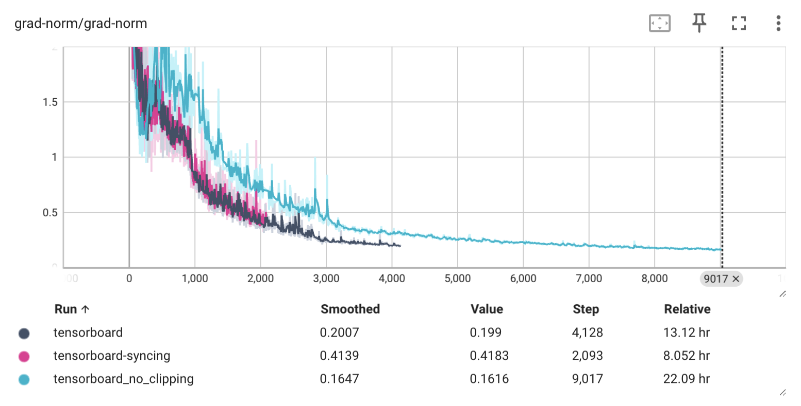
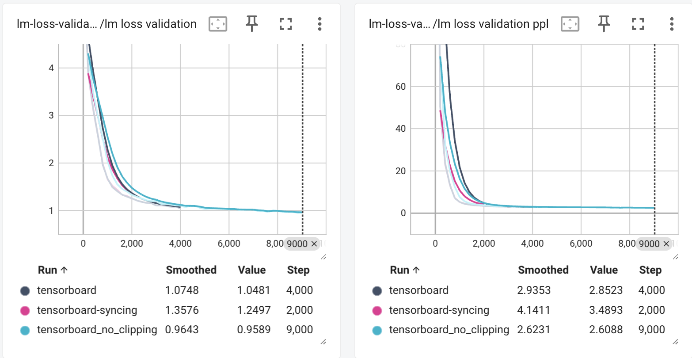
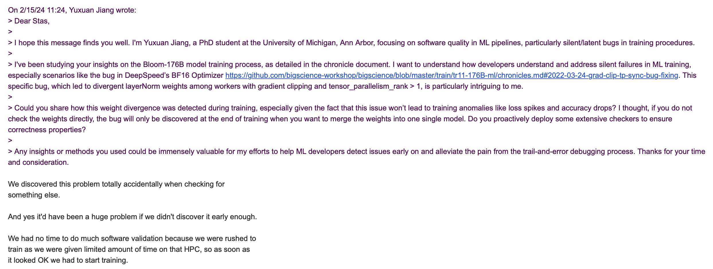

# DeepSpeed `BF16_Optimizer` Gradient Clipping Leading to Model Weights Out-of-Sync

The fix for this bug is available in the [PR 1801](https://github.com/microsoft/DeepSpeed/pull/1801), specifically the commit [e24814a10de04ce280efe2adb027b023e3336493](https://github.com/microsoft/DeepSpeed/pull/1801/commits/e24814a10de04ce280efe2adb027b023e3336493).

The bug was originally reported in the Bloom-176B model training process, where the model norm weights were out-of-sync when using the `BF16_Optimizer` with **gradient clipping** and **tensor model parallelism (TP rank > 0)**.

**The cost of this bug is high**, as it leads to incorrect model weights. Though the developers were able to detect the bug in time, fixing its impact (restore the divergent model weights) took a significant amount of time.

## Environment Setup

**Pre-requisites**: You need to have at least two GPUs to reproduce the bug.

**Note**: You are advised to use a virtual environment to install the required dependencies.

1. First install DeepSpeed version 0.6.2 locally in the editable fashion.

   ```bash
   git clone https://github.com/microsoft/DeepSpeed.git
   cd DeepSpeed
   git checkout v0.6.2
   pip3 install -r requirements/requirements.txt
   pip3 install -e .
   ```

   Note: If you still face dependency issues, you can use the `install.sh` script to install and check for the required dependencies.

2. Download bigscience/Megatron-DeepSpeed.

   ```bash
   git clone https://github.com/bigscience-workshop/Megatron-DeepSpeed.git
   git checkout thomas/test_different_layer_norm
   ```

   Install the following dependencies by `pip install -r requirements.txt`. **Do comment out the `deepspeed` line in the `requirements.txt` file before you proceed**.

3. Install CUDA nvcc compiler (this is required for `apex`).
   1. Please check the CUDA version shipped with your PyTorch installation.
   2. Download and the install the CUDA nvcc compiler **with the same CUDA version as PyTorch's**. You can conveniently install it using the script here: [https://github.com/TimDettmers/bitsandbytes/blob/main/install_cuda.sh](https://github.com/TimDettmers/bitsandbytes/blob/main/install_cuda.sh)

4. Install the `apex` library.
   Please go to the [NVIDIA Apex](https://github.com/NVIDIA/apex) repository and follow the installation instructions.

5. Install the `pytest` library.

   ```bash
   pip install pytest
   ```

6. Modify the `deepspeed` library to reproduce the bug.
   1. Open the `deepspeed/runtime/bf16_optimizer.py` file.
   2. Replace the `get_grads_for_norm` function with the following code:

   ```python
    @torch.no_grad()
    def get_grads_for_norm(self, for_clipping=False):
        grads = []
        tensor_mp_rank = bwc_tensor_model_parallel_rank(mpu=self.mpu)
        for i, group in enumerate(self.bf16_groups):
            for j, lp in enumerate(group):
                if not for_clipping:
                    if hasattr(lp, PIPE_REPLICATED) and lp.ds_pipe_replicated:
                        continue

                if not (tensor_mp_rank == 0 or is_model_parallel_parameter(lp)):
                    continue # YUXUAN: as compared to the original code, this line is moved out by one indentation level

                if not self.fp32_groups_has_gradients[i][j]:
                    continue

                grads.append(self.fp32_groups_gradients[i][j])

        return grads
    ```

7. Depending your numpy and pytorch version, you may need to manually change all `torch._six` to `torch` and all `np.float` to `float` in both Megatron-DeepSpeed and DeepSpeed repos.

## Reproduce

We run the developer's test to reproduce the bug.

1. Go to the `Megatron-DeepSpeed` directory.

   ```bash
   cd Megatron-DeepSpeed
   export PYTHONPATH=$PYTHONPATH:$(pwd)
   ```

2. Run the test.

   ```bash
    pytest tests/test_training.py::MegDSTestTraining::test_layer_norm_consistent_0_bf16
    ```

    The test should fail, and you should see an error message similar to the following:

    ```bash
    FAILED tests/test_training.py::MegDSTestTraining::test_layer_norm_consistent_0_bf16 - AssertionError: Tensor-likes are not equal!
    ```
    
## What to expect

Model norm weights should be in sync across all the model replicas after sync. When we check the checkpoint files dumped from different model replicas, the model norm weights should be the same. However, the bug causes the model norm weights to be out-of-sync.

**You should expect the test to pass if you undo step 6 of the environment setup.**

## What is the bug

The bug is in the `deepspeed/runtime/bf16_optimizer.py` file. The `get_grads_for_norm` function is not correctly handling the tensor model parallelism (TP rank > 0) when using the `BF16_Optimizer` with **gradient clipping**.

## Root Causes

DeepSpeed's `BF16_Optimizer` has a function `get_grads_for_norm` that is used to get the gradients for the norm.

Below is the incorrect implementation of the function:

```python
@torch.no_grad()
def get_grads_for_norm(self, for_clipping=False):
    grads = []
    tensor_mp_rank = bwc_tensor_model_parallel_rank(mpu=self.mpu)
    for i, group in enumerate(self.bf16_groups):
        for j, lp in enumerate(group):
            if not for_clipping:
                if hasattr(lp, PIPE_REPLICATED) and lp.ds_pipe_replicated:
                    continue

            if not (tensor_mp_rank == 0 or is_model_parallel_parameter(lp)): # this line is incorrectly placed, should be inside the `if not for_clipping` condition
                continue

            if not self.fp32_groups_has_gradients[i][j]:
                continue

            grads.append(self.fp32_groups_gradients[i][j])

   return grads
```

High-level speaking, the function should have the line `if not (tensor_mp_rank == 0 or is_model_parallel_parameter(lp))` inside the `if not for_clipping` condition.

To understand this better, let's talk about the desired behavior of the function and the meaning of the if conditions `not (tensor_mp_rank == 0 or is_model_parallel_parameter(lp))` and `hasattr(lp, PIPE_REPLICATED) and lp.ds_pipe_replicated`.

### Desired Behavior

This function, as the name suggests, is used to get the gradients for the norm calculation. Norm by definition is a scalar value, and it is calculated using the gradients of the model parameters. Due to the complicated parallelism settings, some parameters might be partitioned, some might be replicated, and some might be shared across different model replicas. Therefore, it is very important to recognize whether a parameter is replicated or partitioned, to avoid double counting the gradients.

The conditions `hasattr(lp, PIPE_REPLICATED) and lp.ds_pipe_replicated`, and `not (tensor_mp_rank == 0 or is_model_parallel_parameter(lp))` are used for this purpose of avoid multi-counting. Specifically for the second condition, if a parameter is not partitioned (i.e. it is not a model parallel parameter), only one replica (heuristically, the replica on the node with rank == 0) should be used to calculate the gradients.

### The dual-purpose of the function

Apart from collecting unique gradients for the norm calculation, this function also has a untold purpose of collecting gradients that's going to be clipped. This purpose is served when people killing people 

The `for_clipping` parameter is used to distinguish between the two purposes. If `for_clipping` is `True`, the function would collect all the gradients, regardless of the partitioning or replication of the parameters. If `for_clipping` is `False`, the function would only collect the unique gradients (for norm calcuation).

### The Bug

The bug is that the condition `not (tensor_mp_rank == 0 or is_model_parallel_parameter(lp))` is not correctly placed. It should be inside the `if not for_clipping` condition. This is because the condition is used to collect unique gradients for the norm calculation, and it should not be used when collecting gradients for clipping.

When the condition is placed outside the `if not for_clipping` condition, it is incorrectly used to collect gradients to be clipped would be inconsistent across different workers. This is because the condition would only collect the gradients from the worker with rank == 0, and would ignore the gradients from other workers. Thus, other workers would not have their gradients clipped, leading to inconsistent model weights.

The range of this bug is limited to layernorm weights in transformer layers, as layernorm weights are duplicated across different workers while other weights are usually partitioned. Primarily the reason why layernorm weights are duplicated on each worker is to avoid communication overhead (please refer to section 3 of the paper *Megatron-LM: Training Multi-Billion Parameter Language Models Using Model Parallelism*).

## Bug Detection

This bug will lead to inconsistent model weights across tensor parallel ranks, which, however, does not have any manifestation during the training and validation process. No loss spikes and accuracy drops will happen.

I ran the [codeparrot_small model training](https://huggingface.co/blog/megatron-training) process with the bug present (*tensorboard*) and absent (*tensorboard-syncing*) sync for 2000 iterations (~12 hours on ring18 with 2DP + 4TP). The gradient norm always aligns.


Loss and perplexity showed mild differences at the very beginning. However as can be seen from the figure below, they quickly converge to the same value near 2000 iterations.


This leads to the conclusion that the bug is not detectable during the training and validation process, unless developers are specifically looking for weight consistency.

As per Stas Bekman (leader of the bloom project), the bug was detected completely by accident, and if it wasn't detected, it would have led to severe consequences.


## Bug Impact

As mentioned in the previous section, the bug does not have any manifestation during the training and validation process. The problem occurs when developers want to merge the checkpoint files into a single model replica. Since there are multiple sets of layerNorm weights, the developers need to either average or choose one of them, which potentially leads to worse model accuracy.

I measured the impact on model accuracy by averaging the layerNorm weights at both 2000 and 4000 iterations:

| Iteration | Type | Loss | PPL | Loss (Avg) | PPL (Avg) | Loss Diff | PPL Diff | Loss Diff (%) | PPL Diff (%) |
|-----------|------|------|-----|------------|-----------|-----------|----------|---------------|--------------|
| 2000      | Valid | 1.249654E+00 | 3.489136E+00 | 1.263902E+00 | 3.539203E+00 | + 0.014248 | + 0.050067 | + 1.14% | + 1.43% |
| 2000      | Test | 1.181316E+00 | 3.258658E+00 | 1.213769E+00 | 3.366148E+00 | + 0.032453 | + 0.107490 | + 2.74% | + 3.30% |
| 4000      | Valid | 1.082995E+00 | 2.953512E+00 | 1.115996E+00 | 3.052606E+00 | + 0.033001 | + 0.099094 | + 3.05% | + 3.36% |
| 4000      | Test | 1.002177E+00 | 2.724205E+00 | 1.049001E+00 | 2.854798E+00 | + 0.046824 | + 0.130593 | + 4.67% | + 4.79% |

The loss and perplexity are higher when the layerNorm weights are averaged, indicating the model accuracy is worse.

Due to resource limit, I was only able to run the training process for 4000 iterations. As can be seen from the table, the loss and perplexity differences are roughly increasing as the training process goes on. This indicates that the impact of the bug is increasing as the training process goes on. The total training process will take 150,000 iterations, and I think the impact of the bug will be more severe if the training process goes on. 

## Potential Ways to Detect the Bug Automatically

Detection of this bug can go two ways, 1 from the underlying root cause and needs the tracer to have more semantic understanding of the code, and 2 from the high-level behavior of the model, the detection of the bug can be simple and straightforward, but since the detection is at a higher level, it might not be able to pinpoint the exact root cause.

1. Lower-level root-cause detection: The `get_grads_for_norm` function is problematic. It contains a bad design pattern where the function is used for an unspoken purpose of collecting gradients to be clipped. The function should be split into two functions, one for collecting unique gradients for the norm calculation, and one for collecting gradients to be clipped. **On the one hand**, if we infer from other optimizers that functions like `get_grads_for_norm` are used to collect unique gradients for the norm calculation, we can observe if the function is multi-counting the gradients. If the function is multi-counting the gradients, we can infer that the function is not implemented correctly or contains a bad design pattern. **On the other hand**, if we infer from other optimizers that functions like `get_grads_for_norm` are used to collect gradients to be clipped, we can observe if the function is not collecting the gradients from all the layers on the worker. If the function is not collecting the gradients from all the workers, we can infer that the function is used for an unspoken purpose of collecting unique gradients for the norm calculation.

2. High-level behavior detection: The bug causes the model norm weights to be out-of-sync. We can detect the bug by checking if the model norm weights are in sync across all the model replicas after sync. When we check the checkpoint files dumped from different model replicas, the model norm weights should be the same. However, the bug causes the model norm weights to be out-of-sync. We can write a test to check if the model norm weights are in sync across all the model replicas after sync. If the model norm weights are not in sync across all the model replicas after sync, we can infer that the bug is present.

### Challenges #1

The first approach is challenging due to the following reasons:

1. Different optimizers, though highly similar, can have different interfaces (in terms of method names or abstraction levels). It might be hard to match an existing invariant to the `get_grads_for_norm` function in BF16_Optimizer.
2. The `get_grads_for_norm` function's issue lied in an unspoken purpose that existing functions in other optimizers might not have. The invariant check might not be direct enough to pinpoint the exact root cause of the bug. (It might only be able to infer that the function is multi-counting the gradients, which can be annoying because developers want to do this on purpose although they did that incorrectly.)

### Challenges #2

The second approach is challenging due to the following reasons:

1. Due to varied paralleism settings, it is not straightforward to check if model weights are in sync across all the model replicas after sync. It might require to understand what weights are shared, what weights are partitioned, and what weights are replicated across different model replicas. Only the duplicated weights are affected by the bug.
