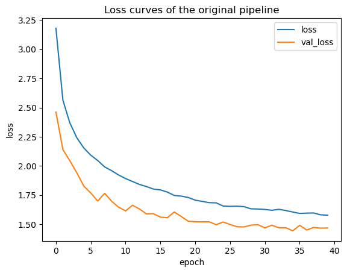
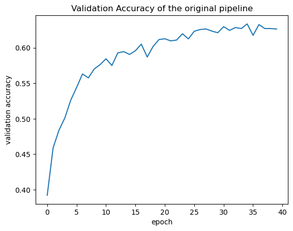
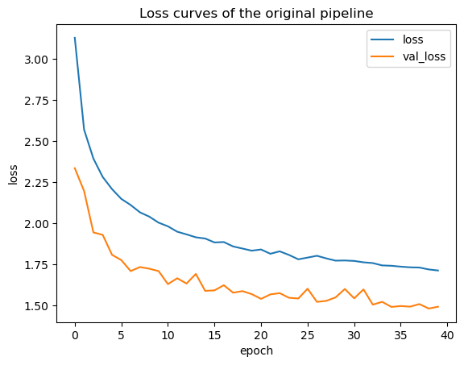
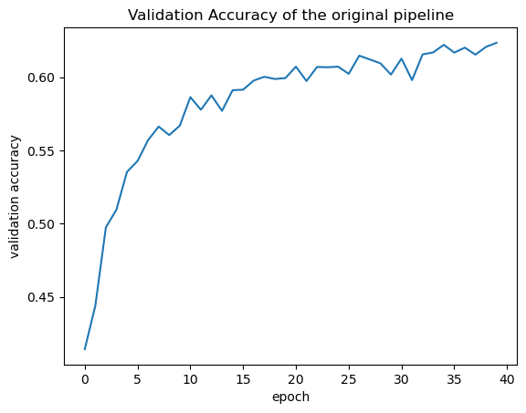
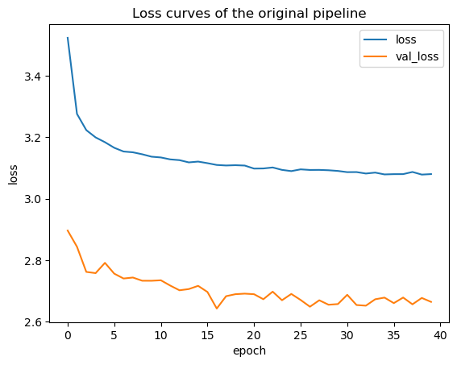
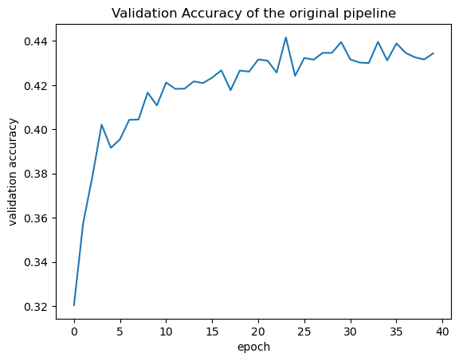

# PyTorch-FORUM84911

https://discuss.pytorch.org/t/obtaining-abnormal-changes-in-loss-and-accuracy/84911

## Setup

1. Create a conda environment
2. Install PyTorch and efficientnet_pytorch

```bash
conda install pytorch torchvision torchaudio pytorch-cuda=12.1 -c pytorch -c nvidia
pip install efficientnet_pytorch
```

## Run

```bash
python bug.py
```

## What to expect

`bug.py` will train the pretrained model [efficientnet-b0](https://github.com/lukemelas/EfficientNet-PyTorch) on [CIFAR100](https://www.cs.toronto.edu/~kriz/cifar.html), a dataset of 100 classes of 32x32 images. The training will run for 40 epochs.

After training finishes, the model will dump the loss and accuracy for each epoch into `case_3_res.json`. The model itself will be saved as `case_3_model.pth`.

## What is the bug

- **Model Performance**: As shown from the accuracy and loss log, the model is not learning. The accuracy stays below 1% and the loss does not show a decreasing pattern.
- **Training Speed and Memory Usage**: The training speed is very slow. It takes about 1.5 hours per epoch on a Tesla A40 or a RTX A2000 GPU with batch size equal to 4. The memory usage is also very high. It takes about 11GB GPU memory to train the model with batch size equal to 4. 

## Root Causes

- **All major layers of the model are frozen**. The only trainable layers are the batch normalization layers. The model is not learning because the frozen layers are not updated.

  ```python
  for name,param in model_transfer.module.named_parameters():
      if("bn" not in name):
          param.requires_grad = False

  for param in model_transfer.module._fc.parameters():
      param.requires_grad = False
    
  print(model_transfer.module._fc.in_features)
  ```

  After fixing this issue, the model starts to learn (from ~1% to ~10%).

- **Mismatch between input image resolution and preprocessing rescales**. The input preprocess pipeline rescales the input image to 1024x1024, which does not match the model's input resolution of 224x224. Also, since the CIFAR100 dataset have only 32x32 images, rescaling to 1024x1024 is inappropriate.

  ```python
  train_transforms = transforms.Compose([
      transforms.Resize((1024,1024)),
      transforms.RandomHorizontalFlip(),
      transforms.RandomRotation(10),
      transforms.ToTensor(),
      transforms.Normalize([0.485, 0.456, 0.406], 
                          [0.229, 0.224, 0.225])
  ])
  ```
  
  The effect of this issue is two fold:
    1. The model's input is not what it expects. The model expects a 224x224 image, but the input is a 1024x1024 image. This will cause the model to perform poorly.
    2. Excessive computation and memory usage. The model's input is 1024x1024, which is roughly 20 times larger than the expected 224x224. This leads to additional computation and memory usage. After fixing this issue, the 1.5 hours per epoch is reduced to 3 minutes per epoch and the memory usage is also significantly reduced.

    **This is the most important issue that needs to be fixed.** After this, the model starts to learn much better (from ~10% to ~40%).

- **Learning Rate and Batch Size**
  - **Learning Rate**: The learning rate is a little large. The learning rate is set to 0.01. 
  - **Batch Size**: The batch size is a little small. The batch size is set to 4.
    Decreasign the learning rate to 0.005 and increasing the batch size to 64 will help the model to learn better (from ~30% to ~45%) and faster.

## How to fix

1. Fix the root causes mentioned above.
    - Set requires_grad to True for all layers.
    - Resize the input image to 224x224.
    - Decrease the learning rate to 0.005.
    - Increase the batch size to 64.

## Potential Ways to Detect the Bug Automatically

The four root causes mentioned above can be categorized into roughly two categories:

- **Training Hyperparameter Mismatch**:
  - **Learning Rate**: The learning rate is too large.
  - **Batch Size**: The batch size is too small.
- **Training Misconfiguration**:
  - **Frozen Layers**: All major layers of the model are frozen.
- **Preprocessing Misconfiguration**:
  - **Input Image Resolution**: The input image resolution does not match the model's input resolution.

### Summary

| Root Cause Type | Possible with Static Detection? | Requirement to Perform Static Detection | Techniques to Perform Static Detection |
| --------------- | ------------------------------- | - | - |
| Training Hyperparameter Mismatch | Yes | Previous runs of the same pipeline or similar pipeline issues | Anomaly Detection from Previous Runs |  
| Training Misconfiguration | Yes | | Static Code Analysis \| Anomaly Detection |
| Preprocessing Misconfiguration | Yes | | Static Code Analysis \| Anomaly Detection |

### Opportunities for Static Detection

#### 1. Training Hyperparameter Mismatch (Anomaly Detection from Previous Runs)

For this type of issues, it is hard to detect them statically for just any pipeline. However, if we have a large number of pipelines or previous runs identified with **same model**, **same dataset**, and **same training method**, we can do **anomaly detection** to check for outliers. If a pipeline's learning rate or batch size is too large or too small, it is likely to be an outlier.

##### Challenges & Limitations

This approach is limited to the pipelines that have the same model, dataset, and training method. This might be a overly strict requirement. However, it is possible to relax this requirement. For example, we can relax the requirement of **same dataset** to **similar dataset** (i.e. dataset with similar characteristics such as size, diversity, and resolution etc.).

Also note that this approach might not be able to check for subtle issues. For example, if the learning rate is 0.01 and the optimal learning rate is 0.005, this approach might not be able to detect this issue. However, if the learning rate is 0.01 and the optimal learning rate is 0.0001, this approach will be able to detect this issue.

#### 2. Training Misconfiguration (Static Code Analysis | Anomaly Detection from Previous Runs)

For this type of issues, it is possible to detect them statically. **The oracle is if the model's layers are frozen.** If all major layers are frozen, we can report this issue. The rationale is that if all major layers are frozen, the model is not learning.

##### Challenges & Limitations

However, for this particular issue, there is a practical challenge in applying this approach. The reason is that the model's major layers are indeed frozen but the model's batch normalization layers are not frozen. It is hard to tell from the code which layers are major layers and which layers are not. We can only tell this by looking at the model's architecture as well as well as the variable names. Even if we are able to distinguish different layers, it is still hard to tell which layers are major layers and which layers are not. For example, in this case, the model's batch normalization layers are not major layers, but they are still trainable layers.

Also, the definition of major layers might depend on the specific task. For example, in a finetuning task, only the last few layers (usually the last fc layer) are major layers. In a training from scratch task, all layers are major layers.

**The rational for using anomaly detection from previous runs is the same as the one mentioned in the previous section.**

#### 3. Preprocessing Misconfiguration (Static Code Analysis | Anomaly Detection from Previous Runs)

It is intuitive to statically detect this specific issue where the input image resolution does not match the model's input resolution. In this issue case, the model takes 224x224 images as input, but the input image is rescaled to 1024x1024, and the dataset contains only 32x32 images. This is a clear mismatch. 

***Correction***: The mismatch is not between the specific resolution but rather the scale of objects in the photo. However (the good news), I think most of the time there is a linear relationship between object scales and image resolution. So we can still report potential issues when resolution mismatches, just with a lower confidence. Still, this correction has two implication:

- The best input resolution cannot be known from model architecture. One possibly to gain insights about model can be from the dynamic invariant inference technique.
- Ideally, our tool needs to have hard-to-measure insights from the datasets to be able to find mismatches such as object scales.

##### Challenges & Limitations

There isn't really challenges for this approach. However, this approach is limited to resoluation mismatch issues in image datasets.

It is unclear how to detect other types of preprocessing misconfiguration issues, such normalization. Also, for dataset of other types of data, such as text, audio, and video, it is unclear how to define a "mismatch" between the input data and the model's input. ***We need additional research on other modalities to explore this.***

### Opportunities for Runtime Detection

Runtime detection is a complementary approach to static detection for types of issues where static detection is not available due to lack of previous runs. It is possible to detect the issues mentioned above at runtime.

#### 1. Training Hyperparameter Mismatch

We can detect this type of issues at runtime by monitoring the training speed. A highly likely indicator of this type of issues is that the loss and accuracy jumps around or moves very slowly at a nearly consistent speed.

#### 2. Training Misconfiguration

We can detect this type of issues at runtime by monitoring the model's loss and accuracy. A highly likely indicator of this type of issues is that the loss and accuracy jumps around or moves very slowly at a nearly consistent speed or may not even move at all.

We can also monitor the model's gradients. If the gradients are all zeros, it is likely that the model's layers are frozen. However, this approach is not very reliable because the gradients might be all zeros for other reasons, and it brings additional overhead to the training process.

#### 3. Preprocessing Misconfiguration

We can detect this type of issues at runtime by monitoring the memory usage and GPU utilization. In this particular issue, the 32x32 images are rescaled to 1024x1024 images. This leads to excessive memory usage and low GPU SM utilization. If we monitor the memory usage and GPU utilization, we can detect this issue.

## Update 1/27, 2024 - Ziming

### Issue: Number of Trainable Layers needs to be adjusted properly

When finetuning a pretrained model, the number of trainable layers needs to be adjusted properly.
Usually, the last few layers are trainable, and the rest of the layers are frozen.

In this issue's case, when the last 1/4 layers are trainable, the model achieves much better performance than when all layers are trainable or no layers are trainable.

- No/little trainable Layers -> Too few weights to learn, leading to underfitting
- All Layers Being Trainable -> CIFAR100 dataset is a bit small and might lead to the model overfitting
- Here only freeze 1/4 tunable NN layers (excluding batchnorm layers)

### Experiments: Adjusting the number of active layers

- All active: Converges @around 10 epoch, Acc:0.4




- 1/4 active: Converges @around 30 epoch, Acc: 0.62


- 1/6 active: Still not converge @ 40 epoch, Acc>0.63




- 2 layer active: Converges @around 20 epoch, Acc: 0.41




- All forzen: Converges @ first epoch (not trained), Acc: 0.1

### Revelation (from GPT)

Could we classify this as a silent error in pytorch transfer learning pipeline if the number of active/forzen layer is not adjusted properly? Is there a way to autocapture this latent error?

This issue isn't necessarily a "silent error" in the PyTorch transfer learning pipeline. Rather, it's a matter of model tuning and understanding the implications of freezing layers in the context of your specific task. The number of layers to freeze or activate during transfer learning is largely dependent on the similarity between the original task (on which the pre-trained model was trained) and the new task.

However, it's true that improper adjustment can lead to suboptimal results, as shown in the experiments. This isn't an error that can be automatically captured because it's not a programming error or a violation of the PyTorch API. It's a modeling decision that can affect the performance of the model.

To mitigate this issue, you could implement a systematic approach to experiment with different configurations (like a grid search or a random search over the number of layers to freeze), and then choose the configuration that performs best on a validation set. This would allow you to empirically determine the optimal number of layers to freeze for your specific task.

In addition, monitoring the training process (e.g., by logging the loss and accuracy after each epoch) can help identify if the model is underfitting or overfitting, and adjustments can be made accordingly. 


### Useful Resources to look into:

* Image classification via fine-tuning with EfficientNet #Transfer Learning from Pre-trained Weights: https://keras.io/examples/vision/image_classification_efficientnet_fine_tuning/
* [Google Colab] EfficientNet_Cifar100_finetuning.ipynb https://colab.research.google.com/github/pytorch/ignite/blob/master/examples/notebooks/EfficientNet_Cifar100_finetuning.ipynb#scrollTo=hP_tseP1sXpl
