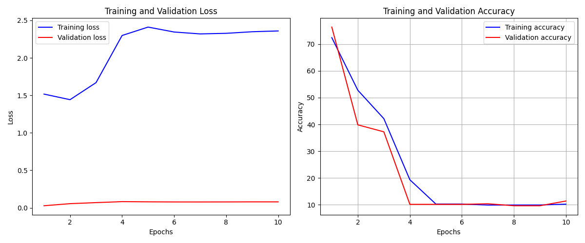
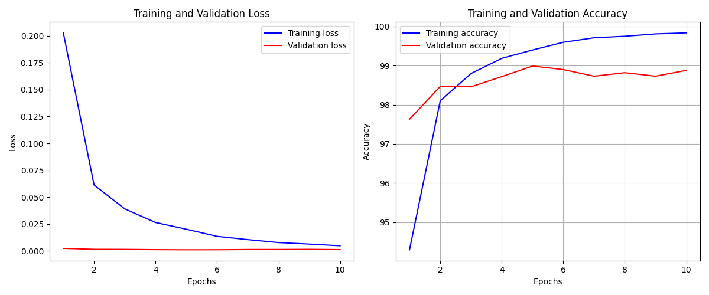
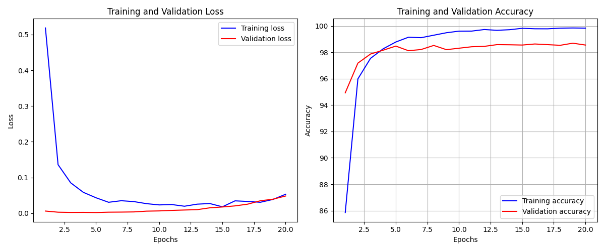
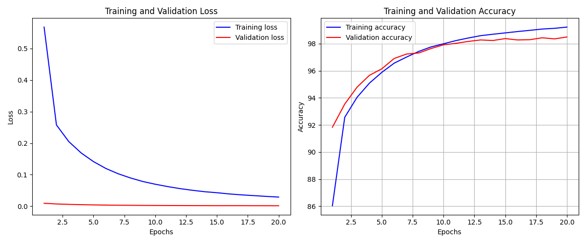

# Stackoverflow-60335387

https://stackoverflow.com/questions/60335387/pytorch-mnist-example-not-converge

## Environment Setup

`pip install -r requirements.txt`

## Run

In `config.json`, set `learning_rate`, `num_epoch` and `output`; set `'is_fix': false` to run the original code and `'is_fix': true` to run the fixed code.

Run `python3 example.py` to generate `<output>.json`.

Run `python3 plot1.py` to generate the `<output>.png`.


## What to expect

The pipeline will train the model on MNIST. After `<num_epoch>` epochs, the loss should converge and the accuracy should be high.

The loss and accuracy for each epoch should be dumped into `<output>.json`

## What is the bug

**Poor model performance**: In the original buggy code, with learning rate `lr=1e-4`, the performance gets worse. The graph is shown below.



## Root Causes

`optimizer.zero_grad()` was missing.

```python
for epoch in range(epochs):
    ...
    for batch_idx, (data, label) in enumerate(train_loader):
        data, label = data.cuda(), label.cuda()
        optimizer.zero_grad()  # This line was missing
        pred_score = model(data)
        loss = criterion(pred_score, label)
        loss.backward()
        optimizer.step()
        ...
```
The graph below is generated by the fixed code with `lr=1e-4`. The loss converges and the validation accuracy is about 99%.

## Impact


**Silent and Not always triggered**

For example, with a small learning rate, the performance of the buggy code is as good as the fixed one. The graph below is generated by the original buggy code with `lr=1e-5`. This may result from the low complexity of the loss function. 

**TODO:** research the impact on missing zero_grad() on more complex datasets and architectures.

The graph below is generated by the fixed code with `lr=1e-5`.


[The loss and accuracy graph generated by the buggy code](./origin_lr1e-4.png) behaves similarly to a model trained with an excessively high learning rate. As a result, users might adjust hyperparameters like learning rate and optimizer but they do not identify the root cause of the bug.


## How to fix

Add `optimizer.zero_grad()` at the beginning of each batch training iteration.

## Potential Ways to Detect the Bug Automatically

General idea: `param.grad.data` should exhibit a periodic pattern.

```python
for name, param in model.named_parameters():
    if param.grad is not None:
        print(f'{name} grad: {param.grad.data}')
```

**Before Training Starts**: Initially, gradients are `None` since no backward pass has been performed.

**After `optimizer.zero_grad()`**: Gradients are set to `0`. This ensures that the gradients from the previous batch do not accumulate with the current batch.

**After `loss.backward()`**: Gradients are computed for the current batch and stored in `param.grad`. These gradients are the derivatives of the loss with respect to the parameters.

**After `optimizer.step()`**: Optimizer updates the parameters using the gradients. The gradients remain until `optimizer.zero_grad()` is called again in the next iteration.

**Throughout Training**: The cycle of zeroing gradients, computing gradients, and updating parameters repeats for each batch, with param.grad.data showing the computed gradients for each batch.

### Possible ways to detect the bug

1. API invoking: track `optimizer.zero_grad()`, `loss.backward()` and `optimizer.step()`

2. Directly check whether `param.grad.data` exhibits a periodic pattern. 

